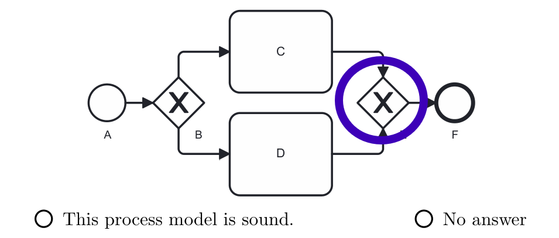
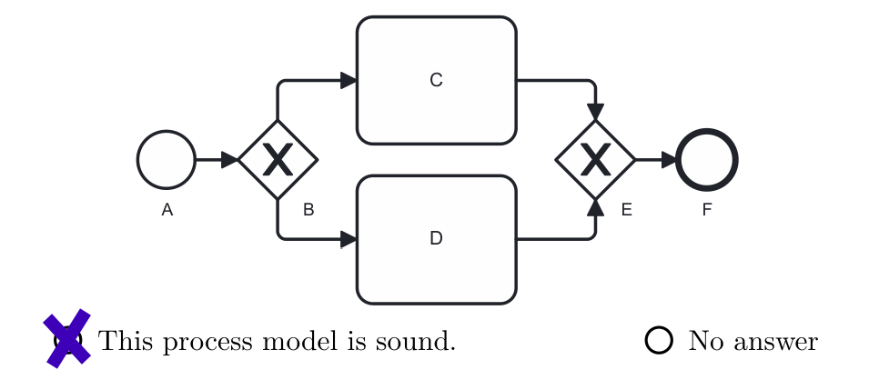
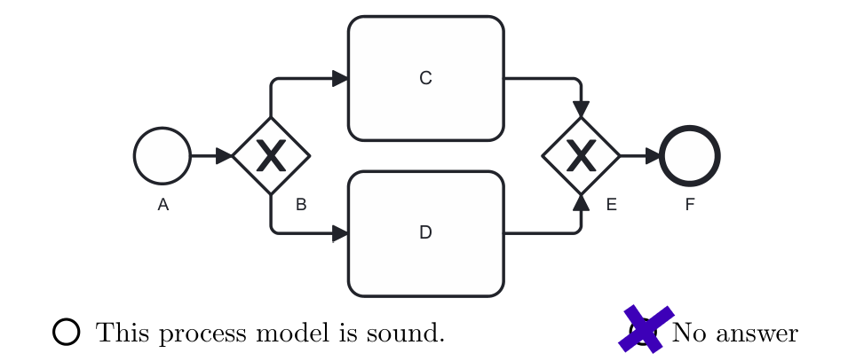

# Instructions for Exercise Items in Level 1 to 5

Please investigate the business process model in BPMN.
What modeling errors can you identify that would cause the model to behave *unsound*?
**Mark each modeling error (as nodes, flows, subgraphs, etc.) with a circle.**
**If you cannot identify any modeling errors (i.e., the model is error-free in your opinion), use the option "This process model is sound.".**
If you cannot solve an exercise, please use the option "No answer".
			

CC BY 2026 Thomas M. Prinz