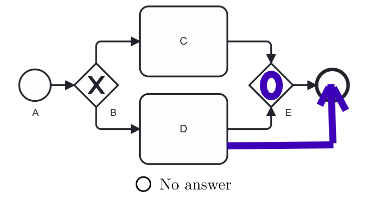
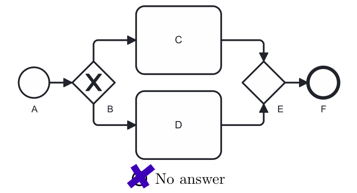

# Instructions for Exercise Items in Level 6 to 10

Please examine the business process model in BPMN.
Some of the gateways have been left blank.
**Please draw the simplest type of gateway in the blank gateways so that the resulting model is *sound*.**
**If filling out the gateway is not sufficient, please indicate the simplest solution to make the process model *sound*.**
If you cannot solve an exercise, please use the option "No answer".

CC BY 2026 Thomas M. Prinz